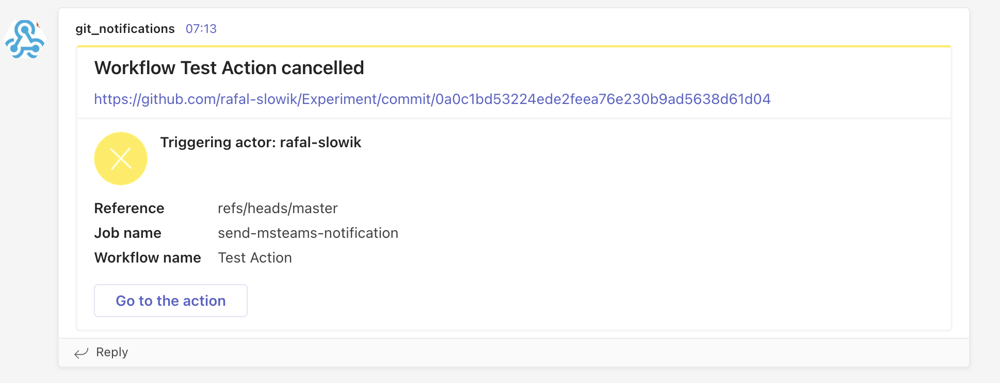
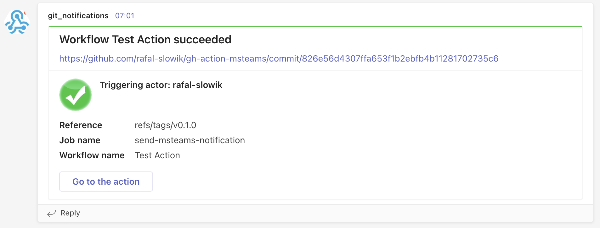
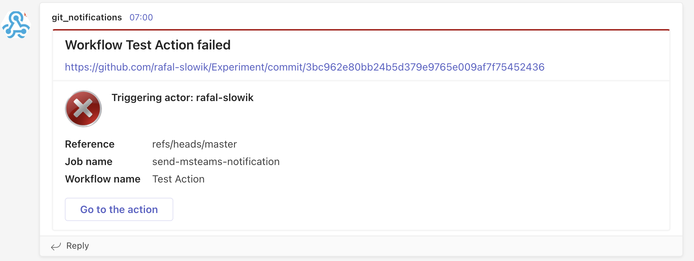

# Simple MS Teams Notifier Action

## A simple GitHub Action, written in python that sends notifications to the MS Teams

### It sends the following types of notifications:
- in case the workflow run has been cancelled

- in case the workflow run succeeded\


- in case the workflow run failed 


### Usage
It is required to provide an active MS Teams webhook, which will allow to send the notification to the channel.
In the example below, the webhook has been added to the repository secrets with the name ```MSTEAMS_WEBHOOK``` and 
has been used in the action along with the parameter ```webhook_uri```:
```
uses: rafal-slowik/gh-action-msteams@master
with:
  webhook_uri: ${{ secrets.MSTEAMS_WEBHOOK }}
```

Full example:
```
name: Test Action
on: [push]

jobs:
  send-msteams-notification:
    runs-on: ubuntu-latest
    name: Sends a notifications to MS Teams
    steps:
      - name: Checkout
        uses: actions/checkout@v3
      - name: Notification
        if: always()
        id: send_notification
        uses: rafal-slowik/gh-action-msteams@master
        with:
          webhook_uri: ${{ secrets.MSTEAMS_WEBHOOK }}
```